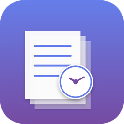

# Coppy - Clipboard History

<p align="center">
  
</p>

コピーした内容を自動でカテゴリ分けして保存する Windows アプリです。


## 概要

クリップボードにコピーした内容を自動で監視し、ルールベースでカテゴリ分類して履歴として保存する、システムトレイ常駐型アプリケーションです。

## 機能

- 自動カテゴリ分類
  - URL
  - メールアドレス
  - コード
  - 電話番号
  - ファイルパス
  - 画像
  - テキスト
- 履歴管理
  - 検索
  - お気に入り
  - ワンクリックコピー
  - URL をブラウザで開く
- データ入出力
  - 履歴データの CSV 出力 / 取込
  - 定型文データの CSV 出力 / 取込
  - UTF-8 / Shift_JIS 対応
  - 定型文をすべてクリア後に取り込むオプション
- 永続保存
  - 設定 / 履歴 / 定型文を `%APPDATA%\Coppy` 配下に保存
- UI
  - システムトレイ常駐
  - ダーク / ライト / システムテーマ
  - Figma ベースの設定ダイアログ

## インストール

### 推奨: インストーラー版（エンドユーザー向け）

[Releases](https://github.com/sayasaya8039/Clipboard_history_AI/releases/latest) から以下のいずれかを入手してください。

| ファイル | 用途 |
|---------|------|
| `coppy-<version>-setup.exe` | **推奨** — インストーラー。スタートメニュー / デスクトップショートカット / 自動起動オプション付き |
| `coppy.exe` | ポータブル版。インストール不要、そのまま実行可能 |

Python ランタイムのインストールは不要です。

### 開発者向けセットアップ

必要条件: Python 3.10 以上 / Windows 10・11

```bash
git clone https://github.com/sayasaya8039/Clipboard_history_AI.git
cd Clipboard_history_AI
pip install -r requirements.txt
python main.py
```

### ビルド

#### ポータブル EXE

```bash
python -m PyInstaller ClipboardHistory.spec --noconfirm
```

`dist/coppy.exe` が生成されます。

#### インストーラー

[Inno Setup 6](https://jrsoftware.org/isinfo.php) が必要です。

```bash
"%LOCALAPPDATA%\Programs\Inno Setup 6\ISCC.exe" installer\coppy.iss
```

`dist/coppy-<version>-setup.exe` が生成されます。

## 使い方

### 起動

```bash
python main.py
# または
dist/coppy.exe
```

起動するとシステムトレイにアイコンが表示されます。

### 主な操作

| 操作 | 動作 |
|------|------|
| トレイアイコン左クリック | 履歴ウィンドウを表示 |
| トレイアイコン右クリック | メニューを表示 |
| 履歴アイテムダブルクリック | クリップボードにコピー |
| URLクリック | ブラウザで開く |
| ⭐ボタン | お気に入り登録 / 解除 |
| 📋ボタン | クリップボードにコピー |
| 🗑ボタン | 履歴から削除 |

### 設定

トレイアイコン右クリックの「設定」から以下を管理できます。

- 一般
- 履歴
- アイテム
- ショートカット
- 外観
- 出力 / 取込

## プロジェクト構造

```text
Coppy/
├── main.py                 # エントリーポイント
├── config.py               # 設定管理
├── database.py             # SQLite 操作
├── csv_transfer.py         # 履歴 / 定型文の CSV 出力・取込
├── categorizer.py          # ルールベース分類
├── clipboard_monitor.py    # クリップボード監視
├── startup.py              # Windows スタートアップ登録
├── create_icon.py          # アイコン生成スクリプト
├── ui/
│   ├── main_window.py      # メインウィンドウ
│   ├── detail_panels.py    # 詳細パネル
│   ├── dialogs.py          # ダイアログ
│   ├── iconography.py      # アイコンフォント
│   ├── settings_dialog.py  # 設定ダイアログ
│   ├── tray_icon.py        # システムトレイ
│   ├── widgets.py          # 共通ウィジェット
│   ├── styles.py           # テーマ / スタイル
│   └── sample_data.py      # サンプルデータ
├── resources/
│   ├── icon.ico            # アプリアイコン (ICO)
│   └── icon.png            # アプリアイコン (PNG)
├── tests/                  # テスト
├── ClipboardHistory.spec   # PyInstaller ビルド設定
├── installer/
│   └── coppy.iss           # Inno Setup インストーラースクリプト
├── foreground_tracker.py   # 前面ウィンドウ追跡（貼り付け対象特定）
├── requirements.txt
└── README.md
```

## 技術スタック

- 言語: Python 3.10+
- GUI: PyQt6
- データベース: SQLite
- ビルド: PyInstaller

## ライセンス

MIT License

## 作者

sayasaya8039

---

Built with Claude Code
